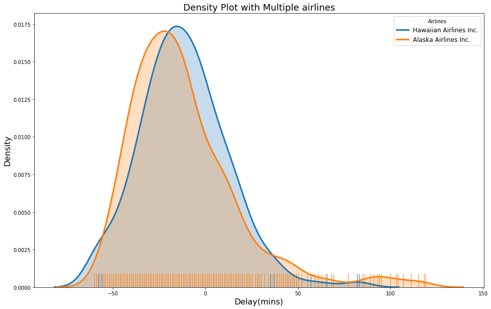

# The Most Punctual Airlines

Exploring Histograms and Density plots to find the most punctual airlines

This work is inspired and learnt from the below articles:
- [Medium.com](https://towardsdatascience.com/histograms-and-density-plots-in-python-f6bda88f5ac0)
- [Fundamentals of Data visualization](https://serialmentor.com/dataviz/)

### Objective:
  Here we are to find the most punctual airlines. We will try to use Histograms and Density plots to come to a conlusion.

### Dataset used: 
  Download the data file (formatted_flights.csv) [here](https://github.com/WillKoehrsen/Data-Analysis/tree/master/univariate_dist/data)
  
### Density Plot:

### Conclusion:
By the graph, we can say that **Hawaiian Airlines** are more punctual than the other airlines:

- The Top two punctual airlines are Hawaiian Airlines Inc and Alaska Airline Inc.
- The next time, you want to be punctual then you know which airlines to go for.

#### **Airlines compared**:
- AirTran Airways Corporation    
- Alaska Airlines Inc.          
- American Airlines Inc.         
- Delta Air Lines Inc.           
- Endeavor Air Inc.              
- Envoy Air                       
- ExpressJet Airlines Inc.        
- Frontier Airlines Inc.          
- Hawaiian Airlines Inc.        
- JetBlue Airways                 
- Mesa Airlines Inc.              
- SkyWest Airlines Inc.           
- Southwest Airlines Co.          
- US Airways Inc.                
- United Air Lines Inc.          
- Virgin America                 
